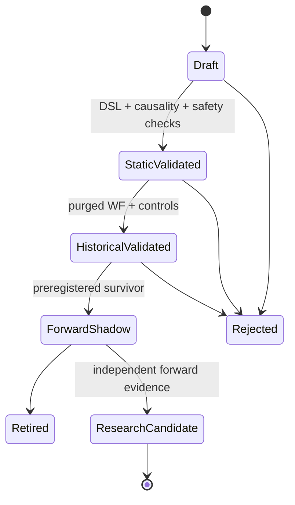

<h1>
  
  Perception-XAlpha Lite
</h1>

[](https://github.com/xuxingjiankr-cpu/perception-xalpha-lite/actions/workflows/ci.yml)
[](https://www.python.org/)
[](#research-integrity-contract)
[](#point-in-time-data-contract)
[](src/xalpha_lite/dsl.py)
[](LICENSE)

> **Quantitative discovery is a multiple-comparisons problem disguised as an optimization
> problem.** Finds fewer factors, on purpose.

A research framework that generates formulaic factors, backtests them on point-in-time data
with real costs, and then tries to prove its own findings wrong before believing them.

Perception-XAlpha Lite separates **hypothesis generation** from **evidence
acceptance**. It can synthesize bounded symbolic factors, but every candidate must survive
chronological isolation, counterfactual controls, permutation tests, and multiple-testing
corrections. Historical evidence can produce a forward-shadow hypothesis; it can never
produce an order. It is deliberately **not** a trading engine.

## Research notes

- **[Wiki](https://github.com/xuxingjiankr-cpu/perception-xalpha-lite/wiki)** — the measurements behind each design decision, including the rejected hypotheses
- **[Research roadmap](https://github.com/users/xuxingjiankr-cpu/projects/1)** — what is being tested, what was rejected, what is waiting on forward data
- **[Site](https://xuxingjiankr-cpu.github.io/perception-xalpha-lite/)** — the same material, rendered

## Audit your own backtest

Fork this, drop your daily returns into `audit/returns.csv`, say how many variants you actually
tried in `audit/audit.json`, and push. The audit runs **in your fork** and writes the verdict to
the run summary. Your returns never leave your repository — this one never sees them.

```bash
python tools/audit_returns.py
```

It asks three questions that are not the same question:

| | |
|---|---|
| **Was the winner picked by luck?** | CSCV splits the sample many ways, takes the best variant in-sample, and checks where it lands out of sample. Above 0.5 and selection is doing the work. |
| **Is the Sharpe big enough to survive the search that found it?** | The deflated Sharpe discounts what you observed by the best you'd expect from that many trials on noise. |
| **Does anything beat zero once the whole family is counted?** | White's Reality Check, with a stationary bootstrap that keeps the serial dependence. |

The example that ships with it is **24 variants of pure random noise**. The best has a Sharpe of
**1.11 annualised** — a number most people would trade. At 24 trials, noise is expected to
produce **1.18**. Verdict: `SELECTION IS DOING THE WORK`.

The trial count is the number of variants you *tried*, including every one you deleted. Not the
number in the file. Understating it is the most common way a backtest passes a test it should
fail, and the tool says so when the two numbers match.

## The pick is published before the session it applies to

[](https://xuxingjiankr-cpu.github.io/perception-xalpha-lite/#live)

Each evening a frozen specification (`224a02ea`) picks one name out of ~4,700 eligible and
commits it here, timestamped, **before that market opens**. The file is append-only.

That ordering is the entire claim. A record scored afterwards always invites the question of
whether the rule moved once the outcome was visible. One committed in advance cannot — it can
be shown to be wrong, but it cannot be edited.

**The dashed span on the left proves nothing, and is drawn that way deliberately.** Those
factors were chosen from a 456-candidate search on data that overlaps it, and on this panel the
selection step alone is worth ~3 bps/day. An in-sample curve that beats every index is what a
selected strategy always looks like. Only the solid span is evidence, and today it is empty.

Two numbers people routinely conflate, over the backtested span:

| | cumulative |
|---|--:|
| Strategy, **raw** net of cost — comparable to an index | ≈ +60% |
| Eligible universe, equal weight | +24.7% |
| CSI300 | +20.3% |
| SSE50 (onshore A50 proxy) | +8.6% |
| Strategy, **excess over universe** — the research metric | +18.5% |

Plotting an excess against a raw index is the oldest trick in the genre, so the chart draws
them as separate lines and says which question each answers. A GitHub Action re-fetches the
index series daily and refuses to redraw if any committed benchmark return has drifted by more
than 5 bps.

## It runs the record it describes

This is not a methods library sitting next to the research. The frozen forward record for the
A-share project it was built for runs on this package — `build_panel`, `point_in_time_eligibility`,
`long_only_book`, `score_log` — appended daily by a scheduled job.

Pointing it at real work is what found the gaps. Four, in one sitting:

| found by using it | what it was |
|---|---|
| `build_panel` defaulted `limit_up`/`limit_down` to `False` | plain OHLCV silently backtested fills on **limit-locked boards**, worth +6.05% a leg against +0.38% for executable ones |
| no point-in-time universe rule | membership had to be hand-rolled, which is where survivorship gets in |
| only a dollar-neutral book existed | the construction nearly everyone actually trades — long-only top-N — could not be expressed |
| the DSL had no time trend | an entire published family (`ts_corr(close, t, w)²`) was inexpressible |

All four are now in the library. The migration was checked rather than assumed: every factor
recomputed both ways across 400 sessions × 5,169 symbols agrees to a maximum cross-sectional
rank difference of **0.00e+00**, and the first book the ported spec produced shares nine of ten
names with the one the original pipeline produced.

The record's value is entirely in what it refuses — `freeze_spec` will not overwrite,
`load_spec` rejects a file edited after freezing, a session already logged appends nothing, and
`score_log` counts only fully elapsed holding windows. CI asserts all four still fire, because
a forward record whose guards stop firing is just a backtest.

```bash
python examples/run_forward_record_synthetic.py
```

That example returns **+0.32% net on prices with no drift** and reports it as
`insufficient_forward_sample` at n=6. Which is the point: the number is noise, and the
framework says so instead of printing it as a result.

## What survives so far

A worked run, end to end: 456 published formulaic factors (Kakushadze 101, GTJA 191, Qlib 158,
academic) searched over a point-in-time A-share panel, ranked **only on the training window**
by the net-of-cost excess of a ten-name book, then reported on the untouched test window.
Ten-session hold, 30 bps round-trip cost on realised turnover, limit-locked legs dropped
rather than priced.

| # | factor | formula | reads as | TEST net | >10% odds | max DD |
|---|---|---|---|--:|--:|--:|
| 1 | `qlib158/rsqr60` | `ts_corr(close, t, 60)²` | how *linear* the last 60 days were — trend quality, not direction | **+0.36%** | 1.13× | −17.9% |
| 2 | `gtja191/alpha_120` | `rank(vwap−close) / rank(vwap+close)` | where the close sits against the day's average price | −0.33% | 0.42× | −21.1% |
| 3 | `alpha101/alpha_042` | `rank(vwap−close) / rank(vwap+close)` | *identical formula to #2* | −0.33% | 0.42× | −21.1% |
| 4 | `qlib158/ma60` | `ts_mean(close, 60) / close` | distance below the 60-day average | −0.44% | 1.31× | −23.5% |
| 5 | `qlib158/sumn60` | `Σ max(−Δclose,0) / Σ \|Δclose\|` | share of the last 60 days' movement that was downward | −0.50% | 1.31× | −28.1% |

Net is per ten-session hold after costs, against an eligible universe returning +0.82%.
">10% odds" is the probability of a >10% move relative to that universe.

**One of the five survives costs.** That is the honest yield of a clean train-side ranking,
and it is the number most factor libraries never report.

Three things in this table are worth more than the ranking itself:

- **Rows 2 and 3 are the same factor.** GTJA-191 #120 and Kakushadze #42 are character-for-
  character identical formulas published under different names. Merging factor libraries and
  counting the total as independent trials therefore overstates the search's breadth — the
  deflated-Sharpe denominator should count *behaviours*, not files.
- **Row 4 has a rank-IC t-statistic of 9.95 and still loses money.** The signal is real and
  strongly significant; it turns the book over fast enough that costs consume it. Statistical
  significance and tradability are different questions, and only one of them pays.
- **Row 1 is not a direction signal at all.** `rsqr60` measures how cleanly a price has been
  trending, not which way. The surviving candidate is a *quality-of-trend* filter.

Across the full top ten, four are net-positive; the best is `academic/illiq` at **+0.76%** per
hold with a **−10.5%** drawdown, and the low-turnover names dominate — outcomes here order by
turnover, not by signal strength.

**None of this is counted as evidence yet.** These were selected from 456 candidates, and a
deflated Sharpe test at that trial count returns `consistent_with_luck`. Ranking by a
different but equally defensible train-side criterion produces a *different* top five, which
is precisely the instability this framework exists to expose.

So the four net-positive factors are now **under forward observation against a frozen spec**
— factor set, book size, holding period, cost and universe rules hashed on **2026-08-06**
(`b19bbc74…`), predictions appended daily before outcomes exist, and scoring restricted to
entries whose holding window has fully matured. The freeze step refuses to overwrite an
existing spec, so a changed rule has to become a new record with a new hash rather than a
quiet revision. Whatever that record says is the answer; nothing in the table above is.

## What it actually does

It is a full research loop, not only a critic:

| stage | what runs |
|---|---|
| **Generate** | bounded symbolic factors from an audited DSL — no `eval`, no subprocess, no network |
| **Backtest** | point-in-time panel, disclosure-date alignment, industry- and size-neutral book, explicit turnover and cost |
| **Control** | counterfactual and placebo variants of every candidate, chronological isolation, purged walk-forward |
| **Discount** | PBO by combinatorially symmetric cross-validation, deflated Sharpe against the full trial count |
| **Record** | immutable audit trail — commit hash, config hash, candidate lineage, every trial counted |

The backtester is the point as much as the search is. A candidate is priced the same way at
every stage, so a factor cannot be screened as one portfolio and validated as another.

**Current status, stated plainly: nothing has graduated.** Candidates are generated and
fully evaluated; none has yet cleared the counterfactual, walk-forward and multiple-testing
gates together. That is the gates doing their job on a price-and-volume factor library, not
the engine failing to run — and unlike most backtests, this one can tell you the exact count
and the reason each candidate died. A framework that reports a hit rate of zero is being
more informative than one that never counted.

This public repository contains **methods only** — no proprietary data, empirical factor
weights, securities, performance tables, or private research conclusions. **It makes no
profitability claim, and it never will.** Every number above and in `examples/` comes from
synthetic data generated by the repository itself.

## Why the gates are this strict

Four biases, each measured on a real equity panel while building this pipeline, and each one
large enough to invent a strategy on its own:


| flaw | what it reports | what survives | unit |
|---|--:|--:|---|
| factors chosen with hindsight | **+2.00** | −1.24 | bps/day, same panel and cost |
| limit-locked legs priced as fillable | **+6.05** | +0.38 | % forward return of those legs |
| universe filtered on whole history | **391** | 77 | eligible names, first year |
| overlapping labels scored as independent | **−5.79** | −2.25 | t-statistic on pure noise |

The first row is the one worth sitting with. Same data, same cost model, same construction —
only the rule for choosing factors differs, and the gap is about 3 bps/day. That is larger
than most published equity-factor results, which means a pipeline that cannot audit its own
selection step cannot tell a discovery from an artifact of choosing.

The mechanism is reproducible on synthetic data with no signal in it at all, in ten seconds:

```bash
python examples/selection_artifact.py          # IR 4.53 manufactured from pure noise
python examples/make_corrections_figure.py     # regenerates the chart above
```


## Why this architecture exists

Quantitative discovery is a multiple-comparisons problem disguised as an optimization
problem. Three ideas anchor the design:

1. **Backtest selection requires an explicit false-discovery model.** Bailey et al. propose
   Combinatorially Symmetric Cross-Validation to estimate the Probability of Backtest
   Overfitting (PBO), because a conventional holdout can be unreliable after extensive
   strategy selection ([paper](https://papers.ssrn.com/sol3/papers.cfm?abstract_id=2326253)).
2. **A Sharpe ratio is not evidence without a trial ledger.** The Deflated Sharpe Ratio
   corrects for selection bias, non-normal returns, and the number of attempted variants
   ([paper](https://papers.ssrn.com/sol3/papers.cfm?abstract_id=2460551)).
3. **Prediction quality and decision quality are different objectives.** Decision-focused
   learning evaluates the downstream decision induced by a prediction rather than relying
   only on point-prediction error ([PMLR](https://proceedings.mlr.press/v119/elmachtoub20a.html)).
4. **The winning candidate inherits the full search history.** The Evidence Lab combines
   dependence-preserving resampling, White's Reality Check, and Romano–Wolf step-down
   inference so a searched winner is never tested as if it had been specified in advance.

The framework therefore optimizes only inside a preregistered research envelope and treats
validation/shadow windows as reject-only evidence.

## System architecture

```mermaid
flowchart LR
    subgraph DATA["Causal Data Plane"]
        A["OHLCV + disclosures"] --> B["Point-in-time alignment"]
        B --> C["Tradability + neutralization controls"]
    end
    subgraph DISCOVERY["Autonomous Discovery Plane"]
        C --> D["Audited factor DSL"]
        D --> E["Economic seeds"]
        E --> F["Bounded mutation + crossover"]
        F --> G["Immutable birth certificates"]
    end
    subgraph VALIDATION["Falsification Plane"]
        G --> H["Purged walk-forward"]
        H --> I["Primary / Counter / Placebo"]
        I --> J["PBO + Deflated Sharpe"]
        J --> Q["Reality Check + step-down max-t"]
    end
    subgraph DECISION["Optional Decision Research"]
        G --> K["Top-K pairwise objective"]
        K --> L["Block-replica stability"]
        L --> M["Independent probability calibration"]
    end
    J --> N["Sealed research artifact"]
    M --> N
    N -. "never automatic" .-> O["Fresh forward shadow"]
```



## Scientific method map

The default discovery pipeline and the optional primitives library are intentionally
distinguished. Availability in the library means **testable**, not **validated alpha**.

| Research layer | Implementation | Scientific basis | Enforced boundary |
|---|---|---|---|
| Disclosure timing | `align_point_in_time_fundamentals()` | Information must not exist before publication | Missing disclosure dates fail closed |
| Symbolic search | audited JSON DSL + bounded generator | Interpretable formulaic alpha search; related to AlphaForge | No `eval`, subprocess, network, or arbitrary Python |
| Neutral portfolios | industry/size residualization | Cross-sectional factor research | Zero-investment research proxy; not an executable short book |
| Regime inference | causal two-state HMM | Hamilton regime switching | Forward filtering only; full-path Viterbi is not online-safe |
| Transition risk | EWS + BOCPD | Critical slowing and Bayesian run-length inference | Risk diagnostic, not directional alpha |
| Local dynamics | DMD/Koopman residual | Linear operator approximation of nonlinear dynamics | Past-window residual; not a universal price predictor |
| Bubble feasibility | simplified LPPLS | Stable reduced-parameter calibration | Fixed grid and stability distribution; no “exact crash date” claim |
| View shrinkage | Black–Litterman posterior | Equilibrium prior plus uncertain views | Shrinkage cannot manufacture information |
| Offline outcomes | Triple Barrier | Profit/loss/time labeling | Future-dependent labels are forbidden as features |
| Finite-sample risk | Hoeffding lower bound | Distribution-free concentration | Dependence and effective sample size still require audit |
| Validation | purge + walk-forward + controls | Temporal isolation and falsification | Validation/shadow never select parents or directions |
| Search correction | CSCV/PBO + DSR | Backtest-overfitting and selection-bias control | Every attempted candidate counts, including failures |
| Family evidence | stationary bootstrap + Reality Check + Romano–Wolf + BH/BY | Dependence-aware data-snooping and multiple-testing inference | A historical rejection is not a deployment decision |
| Decision ranking | bounded Top-K pairwise loss | Decision-focused learning | Fit block only; cannot create absent signal |
| Forecast reliability | Brier, LogLoss, AUC, ECE | Strictly proper scoring-rule framework | Calibration block is independent and frozen |

See the full [literature and implementation map](docs/PAPERS.md).

## Mathematical core

### 1. Industry- and size-neutral factor book

For a cross-sectional factor rank vector `r_t` and control matrix `X_t`, the research
portfolio is the normalized residual of the cross-sectional projection:

```math
\tilde r_t = (I - X_t(X_t^\top X_t)^{-1}X_t^\top)r_t,
\qquad
w_t = \frac{\tilde r_t}{\lVert \tilde r_t \rVert_1}.
```

This removes the constant, point-in-time log market capitalization, and industry dummy
exposures before evaluating the factor. It does not imply that the short leg is executable.

### 2. Decision-focused Top-K weighting

For each fit date, positive names are compared with names immediately below the Top-K
boundary. The bounded simplex solves:

```math
\min_{w \in \Delta_{[l,u]}}
\frac{1}{T}\sum_t\frac{1}{|P_t|}
\sum_{(i,j)\in P_t}\log\!\left(1+e^{-w^\top(x_{ti}-x_{tj})}\right)
+ \lambda\lVert w-w_0\rVert_2^2.
```

Each date receives equal mass. Lower/upper bounds and the prior `w_0` are preregistered;
complete chronological block replicas expose weight instability.

### 3. Independent probability calibration

Composite scores and loss events are calibrated only after weight fitting. Reliability is
reported with Brier score, LogLoss, ROC AUC, expected calibration error, and probability
bucket hit rates. Proper scoring rules are used because they reward honest probabilistic
forecasts rather than arbitrary confidence ([Gneiting & Raftery, 2007](https://doi.org/10.1198/016214506000001437)).

## Research lifecycle



`ResearchCandidate` is still not an execution state. This package defines no state that can
submit a trade.

## Point-in-time data contract

### Prices

```text
date,symbol,open,high,low,close,volume,amount,industry,market_cap,
is_st,is_suspended,is_delisted,limit_up,limit_down
```

Signals are formed at close `t` and evaluated from the next session's open. Industry and
market capitalization are point-in-time controls. Feasibility flags describe the execution
session, not information observed later in that session.

### Fundamentals

```text
symbol,report_date,notice_date,update_date,eps_ytd,bps,roe,roic,
gross_margin,cash_to_profit,revenue_yoy,profit_yoy,debt_ratio,
current_ratio,quick_ratio
```

`notice_date` is mandatory. A statement becomes visible on the first market session strictly
after `max(notice_date, update_date)`. Missing disclosure timestamps are rejected rather than
imputed.

## Quick start

```bash
python -m venv .venv
.venv/Scripts/pip install -e .
python examples/selection_artifact.py          # why this framework exists, in ~10s
python examples/run_synthetic.py
python examples/run_decision_tools_synthetic.py
python examples/run_evidence_lab_synthetic.py
```

Run the factor-discovery CLI on local data:

```bash
xalpha-lite \
  --prices data/prices.csv \
  --fundamentals data/fundamentals.csv \
  --config configs/example.json \
  --output outputs/result.json
```

Stress-test a searched candidate family against a frozen benchmark:

```bash
xalpha-evidence \
  --performance candidate_performance.csv \
  --benchmark benchmark \
  --date-column date \
  --output outputs/evidence.json
```

See the [Dependence-aware Evidence Lab](docs/EVIDENCE_LAB.md) for its input contract,
equations, preregistration requirements, and paper-to-code boundaries.

## Repository map

```text
src/xalpha_lite/
├── pit.py                 # disclosure-aware point-in-time alignment
├── dsl.py                 # allowlisted causal expression language
├── discovery.py           # generation, neutral books, controls, PBO/DSR
├── universe.py            # point-in-time membership, sealed-bar limit detection
├── book.py                # long-only top-N book on the shared cost engine
├── forward.py             # frozen specifications, tamper-evident forward records
├── decision.py            # Top-K weights, block replicas, calibration
├── evidence.py            # stationary bootstrap, Reality Check, step-down inference
├── evidence_cli.py        # searched-family evidence command line interface
├── forward_cli.py         # freeze / log / score command line interface
├── paper_mechanisms.py    # auditable research primitives
└── cli.py                 # research-only command line interface

docs/
├── PAPERS.md              # literature-to-code traceability
├── EVIDENCE_LAB.md        # dependence-aware family-level inference
└── DECISION_TOOLKIT.md    # decision-research API and constraints
```

## Reproducibility contract

Every discovery run records:

- source commit;
- configuration hash;
- price and fundamental data hashes;
- Python, NumPy, pandas, and platform versions;
- immutable factor IDs, parent IDs, operators, and expression hashes;
- the complete attempted-candidate count, including rejected candidates;
- a SHA-256 commitment for undisclosed shadow metrics.

The output contract always includes:

```json
{
  "status": "diagnostic_only_research_only_not_trading",
  "orders": [],
  "automatic_trading_changes": []
}
```

No empirical research artifact is committed to this repository.

## Research integrity contract

- No broker client, account credentials, order submission, strategy overlay, or production
  BUY/SELL gate exists in this package.
- Validation and shadow outcomes may reject a model but may not refit it.
- Future-dependent labels remain in offline label tables and never enter features.
- Candidate direction and parent selection use training data only.
- Failed candidates remain part of the multiple-testing trial count.
- A statistically empty result is valid; the framework never forces a survivor.
- Historical evidence alone cannot authorize deployment.

## Limitations

- The examples are synthetic and make no profitability claim.
- Public financial endpoints may not preserve every historical restatement vintage.
- A contemporary security master creates survivorship bias unless replaced by a genuine
  point-in-time membership history.
- A zero-investment research portfolio is not directly executable in a long-only cash market.
- Equal overlapping tranches approximate a holding horizon; they do not model queue priority,
  borrow availability, market impact, or venue-specific capacity.
- HMM, EWS, BOCPD, DMD, LPPLS, Black–Litterman, and Triple Barrier are minimal auditable
  primitives, not production solvers and not claims of predictive power.
- Stationary-bootstrap inference relies on a defensible weak-stationarity approximation;
  no resampling procedure repairs contaminated data or an incomplete trial ledger.

## License

MIT. Research and educational use only. No investment advice.

See [CHANGELOG.md](CHANGELOG.md) for method-only releases.
