# Perception-XAlpha Lite

> 一个面向研究的、点时点（point-in-time）自主因子发现最小系统。它不是交易机器人，
> 不连接券商，不自动下单，也不会把历史回测结果自动升级为交易策略。

Perception-XAlpha Lite 保留了大型研究系统最重要、也最容易被忽略的机制：

- 财报只在真实披露/更新日之后可见，避免把报告期末当作可知日期；
- 因子由受限 DSL 表达，生成器不能执行任意 Python；
- 训练期负责选择方向，validation 与 shadow 不反馈给生成器；
- label horizon 对应的 purge、walk-forward、Primary/Counter/Placebo；
- PBO 与 Deflated Sharpe Ratio 记录多重尝试造成的选择偏差；
- 量价、价值、质量、成长、财务安全及基本面×行情组合因子；
- HMM、EWS、BOCPD、Koopman/DMD、LPPLS、Black–Litterman、Triple Barrier、
  Chernoff–Hoeffding 等论文机制的精简、可审计实现。

**包含这些模块不代表已经发现 alpha。** 它们只是进入严格证伪流程的研究工具。

## Architecture

```mermaid
flowchart LR
    A["OHLCV + statements"] --> B["Point-in-time alignment"]
    B --> C["Safe factor DSL"]
    C --> D["Technical / fundamental / hybrid candidates"]
    D --> E["Train-only selection"]
    E --> F["Purged walk-forward"]
    F --> G["Primary / Counter / Placebo"]
    G --> H["PBO + DSR"]
    H --> I["Research artifact only"]
    I -. "never automatic" .-> J["Fresh forward shadow"]
```



## Professional mechanism map

| Layer | Mechanism | What it contributes | What it cannot do |
|---|---|---|---|
| Data | PIT disclosure alignment | Prevents financial-statement look-ahead | Does not remove delisting/survivorship bias |
| Regime | causal HMM | Forward-filtered state probabilities | Viterbi full-path labels are not online-safe |
| Transition | EWS + BOCPD | Critical-slowing and change-risk diagnostics | A change point is not directional alpha |
| Dynamics | DMD/Koopman residual | Detects deviations from local linear dynamics | Linear DMD is not a universal price predictor |
| Bubble feasibility | simplified LPPLS | Fit residual and critical-time stability | Does not promise a precise top or crash date |
| View shrinkage | Black–Litterman | Shrinks noisy forecasts toward priors | Cannot manufacture information |
| Labels/exits | Triple Barrier | Standardises TP/SL/time outcomes offline | Future labels must never enter features |
| Tail evidence | Hoeffding bound | Conservative finite-sample hit-rate lower bound | Independence assumptions still require audit |
| Validation | purge/WF + Counter/Placebo | Tests temporal stability and mechanism specificity | Reused historical windows are not fresh OOS |
| Multiple testing | PBO + DSR | Penalises repeated candidate search | Cannot repair bad labels or contaminated data |

See [the literature map](docs/PAPERS.md) for references and implementation boundaries.

## Quick start

```bash
python -m venv .venv
.venv/Scripts/pip install -e .
python examples/run_synthetic.py
```

Or use your own files:

```bash
xalpha-lite \
  --prices data/prices.csv \
  --fundamentals data/fundamentals.csv \
  --config configs/example.json \
  --output outputs/result.json
```

### Price schema

```text
date,symbol,open,high,low,close,volume,amount
```

### Fundamental schema

```text
symbol,report_date,notice_date,update_date,eps_ytd,bps,roe,roic,
gross_margin,cash_to_profit,revenue_yoy,profit_yoy,debt_ratio,
current_ratio,quick_ratio
```

`notice_date` is mandatory. Values first become visible on the market session strictly
after `max(notice_date, update_date)`. A row without a disclosure date fails closed.

## Example output

```json
{
  "status": "diagnostic_only_research_only_not_trading",
  "candidate_count": 20,
  "stage2_count": 16,
  "historically_validated_count": 0,
  "pbo": {"pbo": 0.57, "splits": 70},
  "orders": [],
  "automatic_trading_changes": []
}
```

Zero validated factors is a valid result. The software never forces a target count.

## Research workflow

1. Write an economic mechanism before evaluating data.
2. Freeze windows, horizon, costs, splits and trial count.
3. Generate bounded DSL candidates.
4. Choose factor direction from train only.
5. Quarantine validation and shadow from the generator.
6. Require temporal walk-forward consistency and Primary superiority over Counter/Placebo.
7. Report PBO and DSR after all attempted candidates, including failures.
8. Treat any historical survivor as a forward-shadow hypothesis—not a trade signal.

## Safety boundary

The result schema always contains empty `orders` and `automatic_trading_changes` arrays.
This repository has no broker client, account access, order submission, strategy overlay or
production BUY/SELL gate. Connecting research output to execution is deliberately outside
the project.

## Limitations

- The demo uses synthetic data and makes no profitability claim.
- Public financial endpoints may lack historical restatement vintages.
- A current security master introduces survivorship bias unless replaced with a true PIT master.
- Industry and market-cap neutralisation are not included in the lite implementation.
- Overlapping long-horizon labels require careful portfolio accounting beyond a simple demo.
- The included paper mechanisms are minimal reference implementations, not production solvers.

## License

MIT. Research and educational use; no investment advice.

