# Perception-XAlpha Lite

> 一个面向研究的、点时点（point-in-time）自主因子发现最小系统。它不是交易机器人，
> 不连接券商，不自动下单，也不会把历史回测结果自动升级为交易策略。

Perception-XAlpha Lite 保留了大型研究系统最重要、也最容易被忽略的机制：

- 财报只在真实披露/更新日之后可见，避免把报告期末当作可知日期；
- 因子由受限 DSL 表达，生成器不能执行任意 Python；
- 训练期负责选择方向，validation 与 shadow 不反馈给生成器；
- label horizon 对应的 purge、walk-forward、Primary/Counter/Placebo；
- PBO 与 Deflated Sharpe Ratio 记录多重尝试造成的选择偏差；
- 量价、价值、质量、成长、财务安全及基本面×行情组合因子；
- HMM、EWS、BOCPD、Koopman/DMD、LPPLS、Black–Litterman、Triple Barrier、
  Chernoff–Hoeffding 等论文机制的精简 primitives 库。

**包含这些模块不代表已经发现 alpha。** 它们只是进入严格证伪流程的研究工具。

## Architecture

```mermaid
flowchart LR
    A["OHLCV + statements"] --> B["Point-in-time alignment"]
    B --> C["Safe factor DSL"]
    C --> D["Technical / fundamental / hybrid candidates"]
    D --> E["Train-only bounded generation"]
    E --> F["Purged walk-forward"]
    F --> G["Primary / Counter / Placebo"]
    G --> H["PBO + DSR"]
    H --> I["Research artifact only"]
    I -. "never automatic" .-> J["Fresh forward shadow"]
```



## Professional primitives map

> **Honesty boundary:** the mechanisms below are an audited primitives library. They
> are not all wired into the default factor-search pipeline. The default pipeline uses
> PIT fundamentals, the safe DSL, train-only generation, neutral factor portfolios,
> purged validation, permutation tests, PBO and DSR. HMM/EWS/BOCPD/DMD/LPPLS/BL and
> Triple Barrier must be explicitly preregistered before being added as features or labels.

| Layer | Mechanism | What it contributes | What it cannot do |
|---|---|---|---|
| Data | PIT disclosure alignment | Prevents financial-statement look-ahead | Does not remove delisting/survivorship bias |
| Regime primitive | causal HMM | Forward-filtered state probabilities | Not wired by default; Viterbi full-path labels are not online-safe |
| Transition primitives | EWS + BOCPD | Critical-slowing and change-risk diagnostics | Not wired by default; a change point is not directional alpha |
| Dynamics primitive | DMD/Koopman residual | Detects deviations from local linear dynamics | Not wired by default; linear DMD is not a universal predictor |
| Bubble feasibility | simplified LPPLS | Fit residual and critical-time stability | Does not promise a precise top or crash date |
| View shrinkage | Black–Litterman | Shrinks noisy forecasts toward priors | Cannot manufacture information |
| Labels/exits | Triple Barrier | Standardises TP/SL/time outcomes offline | Future labels must never enter features |
| Tail evidence | Hoeffding bound | Conservative finite-sample hit-rate lower bound | Independence assumptions still require audit |
| Validation | purge/WF + Counter/Placebo | Tests temporal stability and mechanism specificity | Reused historical windows are not fresh OOS |
| Multiple testing | PBO + DSR | Penalises repeated candidate search | Cannot repair bad labels or contaminated data |
| Decision research | bounded Top-K pairwise loss | Aligns a frozen factor book with a ranking boundary | Cannot create information absent from the inputs |
| Weight stability | chronological block replicas | Exposes sensitivity of fitted weights | Is not a posterior and cannot authorise trading |
| Calibration | ridge + logistic probability models | Maps frozen scores to expected outcomes and loss probabilities | Must use an independent block and remain reject-only |

See [the literature map](docs/PAPERS.md) for references and implementation boundaries.

## Optional decision research toolkit

Version 0.2 adds reusable tools for a frozen factor book:

- five chronological fit/calibration/audit/validation/shadow blocks with full purges;
- daily-equal Top-K versus near-boundary pairwise fitting;
- non-negative factor weights with preregistered lower/upper bounds and prior shrinkage;
- complete-block subsample replicas for weight-stability diagnostics;
- independent expected-outcome and ordinary/severe-loss calibration;
- Brier, LogLoss, AUC, ECE, and probability-bucket diagnostics.

The module is optional and is not wired into the default discovery pipeline or any
execution path. The public repository contains no real factor weights, security lists,
performance tables, or private research conclusions. See the
[decision toolkit guide](docs/DECISION_TOOLKIT.md) and its
[synthetic-only example](examples/run_decision_tools_synthetic.py).

## Quick start

```bash
python -m venv .venv
.venv/Scripts/pip install -e .
python examples/run_synthetic.py
```

Or use your own files:

```bash
xalpha-lite \
  --prices data/prices.csv \
  --fundamentals data/fundamentals.csv \
  --config configs/example.json \
  --output outputs/result.json
```

### Price schema

```text
date,symbol,open,high,low,close,volume,amount,industry,market_cap,
is_st,is_suspended,is_delisted,limit_up,limit_down
```

`industry` and point-in-time `market_cap` are required by default. The four feasibility
flags are optional and default to false; `limit_up`/`limit_down` must describe whether the
**next-session execution price** was locked, not whether the security touched a limit later
in the day. Signals are formed at close and evaluated from the next open.

### Fundamental schema

```text
symbol,report_date,notice_date,update_date,eps_ytd,bps,roe,roic,
gross_margin,cash_to_profit,revenue_yoy,profit_yoy,debt_ratio,
current_ratio,quick_ratio
```

`notice_date` is mandatory. Values first become visible on the market session strictly
after `max(notice_date, update_date)`. A row without a disclosure date fails closed.

## Result artifact fields

Discovery artifacts contain status, attempted-candidate counts, validation diagnostics,
PBO/DSR evidence, a sealed shadow commitment, an immutable mechanism tree, and run/data/
config hashes. This repository does not publish a real research result artifact. Every
artifact always contains empty `orders` and `automatic_trading_changes` arrays.

Zero validated factors is a valid result. The software never forces a target count.

The candidate count includes economic seed hypotheses and bounded train-only DSL mutations.
Each expression has immutable parent IDs, generation/operator metadata and an expression hash
in `mechanism_tree`; validation and shadow never select parents.

## Research workflow

1. Write an economic mechanism before evaluating data.
2. Freeze windows, horizon, costs, splits and trial count.
3. Generate bounded DSL candidates and prune train-only behavioural duplicates.
4. Choose factor direction from train only.
5. Quarantine validation and shadow from the generator.
6. Require temporal walk-forward consistency and Primary superiority over Counter/Placebo.
7. Report PBO and DSR after all attempted candidates, including failures.
8. Treat any historical survivor as a forward-shadow hypothesis—not a trade signal.

## Safety boundary

The result schema always contains empty `orders` and `automatic_trading_changes` arrays.
This repository has no broker client, account access, order submission, strategy overlay or
production BUY/SELL gate. Connecting research output to execution is deliberately outside
the project.

## Limitations

- The demo uses synthetic data and makes no profitability claim.
- Public financial endpoints may lack historical restatement vintages.
- A current security master introduces survivorship bias unless replaced with a true PIT master.
- The research book is industry/size neutral and zero-investment, but A-share shorting is
  represented only as a research proxy; it is not an executable cash-equity portfolio.
- Horizon holding is represented by equal overlapping tranches; real fills, borrow, impact and
  capacity still require venue-specific execution data.
- The included paper mechanisms are minimal reference implementations, not production solvers.

## License

MIT. Research and educational use; no investment advice.

See [CHANGELOG.md](CHANGELOG.md) for method-only public updates.
