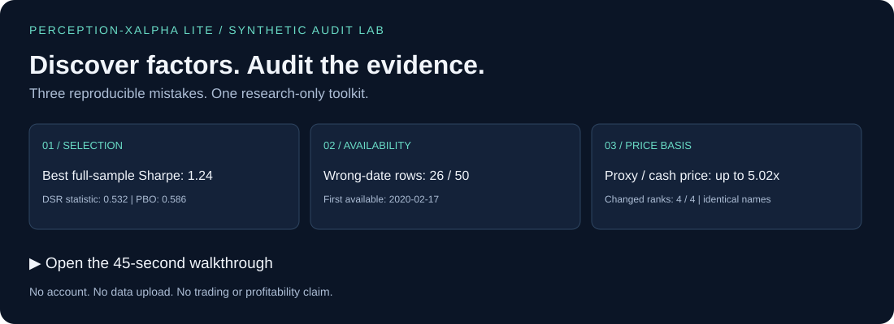

<h1>
  
  Perception-XAlpha Lite
</h1>

**English** | [简体中文](docs/README_CN.md)

## Discover factors. Audit the evidence. Reject overfit backtests.

A Python toolkit for **point-in-time factor discovery and backtest auditing**.
Generate bounded formulaic candidates, then inspect disclosure timing, portfolio construction,
costs, counter/placebo controls and multiple-testing evidence. Research-only; no broker or order path.

[**Open the 45-second walkthrough**](https://xuxingjiankr-cpu.github.io/perception-xalpha-lite/demo.html) ·
[Run in Colab](https://colab.research.google.com/github/xuxingjiankr-cpu/perception-xalpha-lite/blob/main/examples/perception_xalpha_quickstart.ipynb) ·
[Sample report](docs/examples/audit-cases.md) · [Method map](docs/PAPERS.md)

The walkthrough explains generated results; it is not live computation or a speed benchmark.
No account, market dataset, API key or upload is needed. All numbers in **this walkthrough
and its three cases** are synthetic—not investment evidence.

## Try the audits

Install the current source version; these new cases are not assumed to exist in an older
PyPI release:

~~~bash
python -m pip install "perception-xalpha-lite @ git+https://github.com/xuxingjiankr-cpu/perception-xalpha-lite.git@main"
python -m xalpha_lite.audit_cases --output-dir audit-cases-output
~~~

On Windows, substitute `py -3.13` for `python`. The module command works even if the installed
`xalpha-audit-cases` launcher is not on PATH. Colab execution may require a Google account.
Inspect the generated inputs, comparisons, report and hash manifest. Each case answers one question:

| Case | What you can reproduce | What it does not prove |
|---|---|---|
| [Selecting noise](docs/tutorials/01-noise-selection.md) | A high apparent Sharpe after searching 64 random variants; existing DSR and CSCV/PBO diagnostics | That a statistic is a probability of future profitability |
| [Disclosure timing](docs/tutorials/02-disclosure-timing.md) | Report-date leakage and a restatement that must not rewrite earlier features | That a public vendor preserves every historical vintage |
| [Price-basis consistency](docs/tutorials/03-price-basis.md) | Raw cash prices mixed with adjusted OHLC can change ranks on identical names | That OHLC4 is transaction VWAP, or corrected ranks predict returns |

[Reproduce all three from a checkout](docs/tutorials/README.md).
Passing these examples means the demonstrated checks work on their fixtures, not that a factor has alpha.

## Run the full discovery loop

~~~bash
python -m xalpha_lite.demo_cli --output-dir xalpha-demo-output
~~~

The existing demo generates a deterministic toy market, runs readiness checks, bounded factor
synthesis, counter/placebo controls, purged walk-forward, PBO and deflated Sharpe, and saves
artifacts locally. Zero survivors is a legitimate result. A synthetic survivor is not validated alpha.

Before searching real data, use the existing [data doctor](docs/DATA_DOCTOR.md):

~~~bash
xalpha-doctor --prices prices.csv --fundamentals fundamentals.csv --config config.json --output readiness.json
~~~

## Audit your own backtest

From a checkout, replace the bundled synthetic returns in `audit/returns.csv` with daily returns
for your attempted variants, and set the actual trial count in `audit/audit.json`.

~~~bash
python tools/audit_returns.py
~~~

This runs locally; returns are not sent to this project. If using the optional workflow in
a fork, choose repository visibility before adding sensitive data. A public fork exposes
committed returns. Include discarded trials and state the cost and benchmark conventions.
[Evidence Lab](docs/EVIDENCE_LAB.md) covers dependence-aware family tests.

## Paper-backed mechanisms, with explicit boundaries

| Implemented capability | Method and evidence boundary |
|---|---|
| Disclosure-aware inputs | [PIT alignment](src/xalpha_lite/pit.py); publication/revision availability, not reporting-period end |
| Bounded formulaic search | [Audited DSL](src/xalpha_lite/dsl.py) and [search protocol](docs/SEARCH_PROTOCOL.md); proposals do not judge their own validity |
| Selection diagnostics | [CSCV/PBO](https://www.davidhbailey.com/dhbpapers/backtest-prob.pdf) and [DSR](https://www.davidhbailey.com/dhbpapers/deflated-sharpe.pdf); search history and assumptions still matter |
| Searched-family evidence | [Evidence Lab](docs/EVIDENCE_LAB.md); stationary bootstrap, Reality Check and step-down tests |
| Decision research | [Top-K weighting and probability calibration](docs/DECISION_TOOLKIT.md); fitting cannot create missing information |
| Optional scientific primitives | [Literature map](docs/PAPERS.md); HMM/BOCPD/DMD/LPPLS and related primitives are not all wired into the default pipeline and are not validated trading signals |

Read the [architecture and equations](docs/ARCHITECTURE.md) or the
[machine-checked literature registry](docs/USER_SUPPLIED_LITERATURE.md).

## Point-in-time data contract

Prices need coherent OHLC/volume units, point-in-time membership and controls, and realistic
execution eligibility. Fundamentals require `notice_date`; the aligner exposes a value on the
first session strictly after `max(notice_date, update_date)`. Missing disclosure dates fail
closed. Read the [full schemas and limitations](docs/ARCHITECTURE.md#point-in-time-data-contract).

## Research integrity contract

- Research-only. No brokerage access, orders, position changes or automatic promotion.
- Train-only candidate direction and parent selection; validation/shadow never refit.
- Future-dependent labels are not features. Failed trials remain in the search count.
- Data quality, effective sample size, costs, survivorship and execution assumptions must
  be audited separately. No test guarantees profitability.

**Provenance:** the new audit cases and full-loop demo use generated synthetic data.
Previously published [empirical records](docs/RESEARCH_RECORD.md) and `docs/data/` are retained
separately; they are **not** synthetic demonstrations or certified performance.
[Data provenance policy](docs/DATA_PROVENANCE.md).

## Use, cite, contribute

If a check helped your research, consider starring the repository or opening a reproducible
issue. To extend it, start with a [paper-backed mechanism proposal](https://github.com/xuxingjiankr-cpu/perception-xalpha-lite/issues/new?template=mechanism-proposal.yml)
or the [contributor benchmark](docs/CONTRIBUTOR_BENCHMARK.md).
The benchmark measures reproducibility, not returns.

[Citation](CITATION.cff) · [Contributing](CONTRIBUTING.md) · [Changelog](CHANGELOG.md) ·
[MIT license](LICENSE). Educational research tools; no investment advice.
