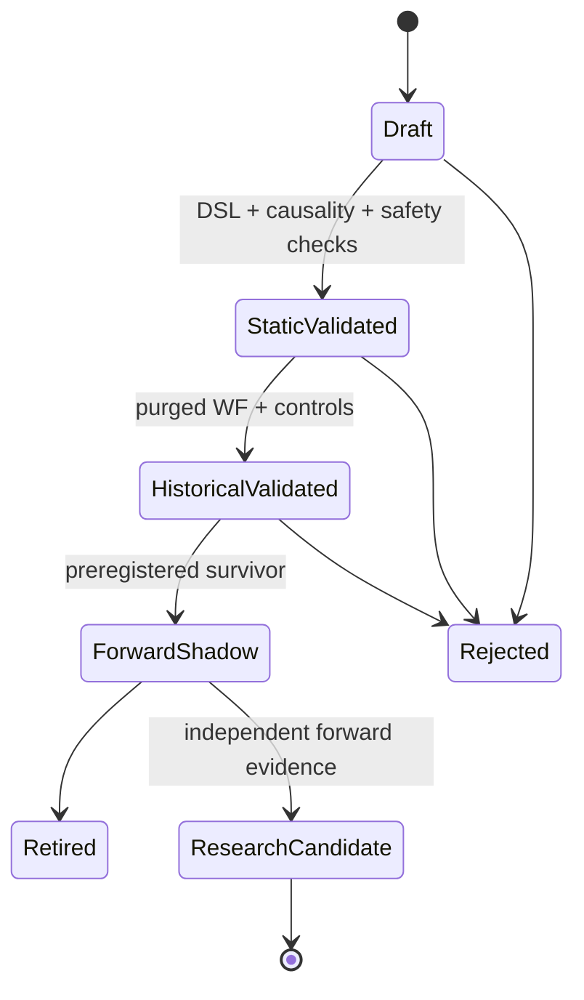

# Architecture and research contracts

[Tool overview](../README.md) · [Synthetic audit tutorials](tutorials/README.md)

## Why this architecture exists

Quantitative discovery is a multiple-comparisons problem disguised as an optimization
problem. Four ideas anchor the design:

1. **Backtest selection requires an explicit false-discovery model.** Bailey et al. propose
   Combinatorially Symmetric Cross-Validation to estimate the Probability of Backtest
   Overfitting (PBO), because a conventional holdout can be unreliable after extensive
   strategy selection ([paper](https://papers.ssrn.com/sol3/papers.cfm?abstract_id=2326253)).
2. **A Sharpe ratio is not evidence without a trial ledger.** The Deflated Sharpe Ratio
   corrects for selection bias, non-normal returns, and the number of attempted variants
   ([paper](https://papers.ssrn.com/sol3/papers.cfm?abstract_id=2460551)).
3. **Prediction quality and decision quality are different objectives.** Decision-focused
   learning evaluates the downstream decision induced by a prediction rather than relying
   only on point-prediction error ([PMLR](https://proceedings.mlr.press/v119/elmachtoub20a.html)).
4. **The winning candidate inherits the full search history.** The Evidence Lab combines
   dependence-preserving resampling, White's Reality Check, and Romano–Wolf step-down
   inference so a searched winner is never tested as if it had been specified in advance.

The framework therefore optimizes only inside a preregistered research envelope and treats
validation/shadow windows as reject-only evidence.

## System architecture

```mermaid
flowchart LR
    subgraph DATA["Causal Data Plane"]
        A["OHLCV + disclosures"] --> B["Point-in-time alignment"]
        B --> C["Tradability + neutralization controls"]
    end
    subgraph DISCOVERY["Autonomous Discovery Plane"]
        C --> D["Audited factor DSL"]
        D --> E["Economic seeds"]
        E --> F["Preregistered CoE / ToT / EA search"]
        F --> G["Immutable birth certificates"]
    end
    subgraph VALIDATION["Falsification Plane"]
        G --> H["Purged walk-forward"]
        H --> I["Primary / Counter / Placebo"]
        I --> J["PBO + Deflated Sharpe"]
        J --> Q["Reality Check + step-down max-t"]
    end
    subgraph DECISION["Optional Decision Research"]
        G --> K["Top-K pairwise objective"]
        K --> L["Block-replica stability"]
        L --> M["Independent probability calibration"]
    end
    J --> N["Sealed research artifact"]
    M --> N
    N -. "never automatic" .-> O["Fresh forward shadow"]
```



## Scientific method map

The default discovery pipeline and the optional primitives library are intentionally
distinguished. Availability in the library means **testable**, not **validated alpha**.

| Research layer | Implementation | Scientific basis | Enforced boundary |
|---|---|---|---|
| Disclosure timing | `align_point_in_time_fundamentals()` | Information must not exist before publication | Missing disclosure dates fail closed |
| Symbolic search | audited JSON DSL + bounded generator | Interpretable formulaic alpha search; related to AlphaForge | No `eval`, subprocess, network, or arbitrary Python |
| Search orchestration | preregistered CoE / ToT / EA protocol | AlphaBench-inspired comparison of proposal strategies | Common DSL/budget and train-only selection; proposal engines never judge validity |
| Neutral portfolios | industry/size residualization | Cross-sectional factor research | Zero-investment research proxy; not an executable short book |
| Regime inference | causal two-state HMM | Hamilton regime switching | Forward filtering only; full-path Viterbi is not online-safe |
| Transition risk | EWS + BOCPD | Critical slowing and Bayesian run-length inference | Risk diagnostic, not directional alpha |
| Local dynamics | DMD/Koopman residual | Linear operator approximation of nonlinear dynamics | Past-window residual; not a universal price predictor |
| Bubble feasibility | simplified LPPLS | Stable reduced-parameter calibration | Fixed grid and stability distribution; no “exact crash date” claim |
| View shrinkage | Black–Litterman posterior | Equilibrium prior plus uncertain views | Shrinkage cannot manufacture information |
| Offline outcomes | Triple Barrier | Profit/loss/time labeling | Future-dependent labels are forbidden as features |
| Finite-sample risk | Hoeffding lower bound | Distribution-free concentration | Dependence and effective sample size still require audit |
| Validation | purge + walk-forward + controls | Temporal isolation and falsification | Validation/shadow never select parents or directions |
| Search correction | CSCV/PBO + DSR | Backtest-overfitting and selection-bias control | Every attempted candidate counts, including failures |
| Family evidence | stationary bootstrap + Reality Check + Romano–Wolf + BH/BY | Dependence-aware data-snooping and multiple-testing inference | A historical rejection is not a deployment decision |
| Decision ranking | bounded Top-K pairwise loss | Decision-focused learning | Fit block only; cannot create absent signal |
| Forecast reliability | Brier, LogLoss, AUC, ECE | Strictly proper scoring-rule framework | Calibration block is independent and frozen |

See the [search-protocol contract](SEARCH_PROTOCOL.md), the full
[literature and implementation map](PAPERS.md), and the
machine-validated [user-supplied literature registry](USER_SUPPLIED_LITERATURE.md).

## Mathematical core

### 1. Industry- and size-neutral factor book

For a cross-sectional factor rank vector `r_t` and control matrix `X_t`, the research
portfolio is the normalized residual of the cross-sectional projection:

```math
\tilde r_t = (I - X_t(X_t^\top X_t)^{-1}X_t^\top)r_t,
\qquad
w_t = \frac{\tilde r_t}{\lVert \tilde r_t \rVert_1}.
```

This removes the constant, point-in-time log market capitalization, and industry dummy
exposures before evaluating the factor. It does not imply that the short leg is executable.

### 2. Decision-focused Top-K weighting

For each fit date, positive names are compared with names immediately below the Top-K
boundary. The bounded simplex solves:

```math
\min_{w \in \Delta_{[l,u]}}
\frac{1}{T}\sum_t\frac{1}{|P_t|}
\sum_{(i,j)\in P_t}\log\!\left(1+e^{-w^\top(x_{ti}-x_{tj})}\right)
+ \lambda\lVert w-w_0\rVert_2^2.
```

Each date receives equal mass. Lower/upper bounds and the prior `w_0` are preregistered;
complete chronological block replicas expose weight instability.

### 3. Independent probability calibration

Composite scores and loss events are calibrated only after weight fitting. Reliability is
reported with Brier score, LogLoss, ROC AUC, expected calibration error, and probability
bucket hit rates. Proper scoring rules are used because they reward honest probabilistic
forecasts rather than arbitrary confidence ([Gneiting & Raftery, 2007](https://doi.org/10.1198/016214506000001437)).

## Research lifecycle



`ResearchCandidate` is still not an execution state. This package defines no state that can
submit a trade.

## Point-in-time data contract

### Prices

```text
date,symbol,open,high,low,close,volume,amount,industry,market_cap,
is_st,is_suspended,is_delisted,limit_up,limit_down
```

Signals are formed at close `t` and evaluated from the next session's open. Industry and
market capitalization are point-in-time controls. Feasibility flags describe the execution
session, not information observed later in that session.

### Fundamentals

```text
symbol,report_date,notice_date,update_date,eps_ytd,bps,roe,roic,
gross_margin,cash_to_profit,revenue_yoy,profit_yoy,debt_ratio,
current_ratio,quick_ratio
```

`notice_date` is mandatory. A statement becomes visible on the first market session strictly
after `max(notice_date, update_date)`. Missing disclosure timestamps are rejected rather than
imputed.

## Quick start

```bash
python -m venv .venv
.venv/Scripts/pip install -e .
python examples/selection_artifact.py          # why this framework exists, in ~10s
python examples/run_synthetic.py
python examples/run_decision_tools_synthetic.py
python examples/run_evidence_lab_synthetic.py
```

Run the factor-discovery CLI on local data:

```bash
xalpha-lite \
  --prices data/prices.csv \
  --fundamentals data/fundamentals.csv \
  --config configs/example.json \
  --output outputs/result.json
```

Stress-test a searched candidate family against a frozen benchmark:

```bash
xalpha-evidence \
  --performance candidate_performance.csv \
  --benchmark benchmark \
  --date-column date \
  --output outputs/evidence.json
```

See the [Dependence-aware Evidence Lab](EVIDENCE_LAB.md) for its input contract,
equations, preregistration requirements, and paper-to-code boundaries.

## Repository map

```text
src/xalpha_lite/
├── pit.py                 # disclosure-aware point-in-time alignment
├── dsl.py                 # allowlisted causal expression language
├── discovery.py           # generation, neutral books, controls, PBO/DSR
├── universe.py            # point-in-time membership, sealed-bar limit detection
├── book.py                # long-only top-N book on the shared cost engine
├── forward.py             # frozen specifications, tamper-evident forward records
├── decision.py            # Top-K weights, block replicas, calibration
├── evidence.py            # stationary bootstrap, Reality Check, step-down inference
├── doctor.py              # fail-closed PIT data readiness and leakage-risk audit
├── synthetic.py           # deterministic zero-setup research inputs
├── evidence_cli.py        # searched-family evidence command line interface
├── doctor_cli.py          # data-doctor command line interface
├── demo_cli.py            # installed-package full-loop demonstration
├── forward_cli.py         # freeze / log / score command line interface
├── paper_mechanisms.py    # auditable research primitives
└── cli.py                 # research-only command line interface

docs/
├── CONTRIBUTOR_BENCHMARK.md # CI-generated contribution scorecard
├── PAPERS.md              # literature-to-code traceability
├── USER_SUPPLIED_LITERATURE.md # generated implementation-boundary registry
├── DATA_DOCTOR.md         # machine-readable data readiness contract
├── EVIDENCE_LAB.md        # dependence-aware family-level inference
└── DECISION_TOOLKIT.md    # decision-research API and constraints

benchmark/submissions/     # machine-validated mechanism and factor cards
research/literature_registry.json # source-of-truth paper audit
examples/perception_xalpha_quickstart.ipynb # one-click Colab contract
```

## Reproducibility contract

Every discovery run records:

- source commit;
- configuration hash;
- price and fundamental data hashes;
- Python, NumPy, pandas, and platform versions;
- immutable factor IDs, parent IDs, operators, and expression hashes;
- the complete attempted-candidate count, including rejected candidates;
- a SHA-256 commitment for undisclosed shadow metrics.

The output contract always includes:

```json
{
  "status": "diagnostic_only_research_only_not_trading",
  "orders": [],
  "automatic_trading_changes": []
}
```

Synthetic demonstrations and existing empirical records are separately identified in the
[data provenance policy](DATA_PROVENANCE.md). Research artifacts never authorize trading.

## Research integrity contract

- No broker client, account credentials, order submission, strategy overlay, or production
  BUY/SELL gate exists in this package.
- Validation and shadow outcomes may reject a model but may not refit it.
- Future-dependent labels remain in offline label tables and never enter features.
- Candidate direction and parent selection use training data only.
- Failed candidates remain part of the multiple-testing trial count.
- A statistically empty result is valid; the framework never forces a survivor.
- Historical evidence alone cannot authorize deployment.

## Limitations

- The new audit cases and full-loop demo are synthetic. Existing empirical records are
  separately labeled; neither constitutes a profitability claim.
- Public financial endpoints may not preserve every historical restatement vintage.
- A contemporary security master creates survivorship bias unless replaced by a genuine
  point-in-time membership history.
- A zero-investment research portfolio is not directly executable in a long-only cash market.
- Equal overlapping tranches approximate a holding horizon; they do not model queue priority,
  borrow availability, market impact, or venue-specific capacity.
- HMM, EWS, BOCPD, DMD, LPPLS, Black–Litterman, and Triple Barrier are minimal auditable
  primitives, not production solvers and not claims of predictive power.
- Stationary-bootstrap inference relies on a defensible weak-stationarity approximation;
  no resampling procedure repairs contaminated data or an incomplete trial ledger.

## License

MIT. Research and educational use only. No investment advice.

See [CHANGELOG.md](../CHANGELOG.md) for method-only releases.
