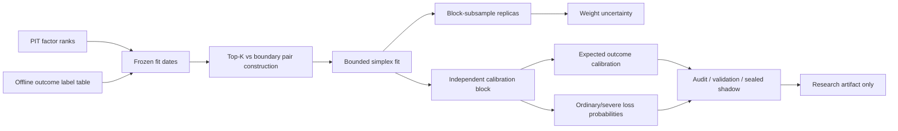

# Decision-focused research toolkit

This optional module converts a frozen set of point-in-time factor ranks into
auditable research objects. It does not select production positions and has no
broker, order, account, overlay, or strategy-gate integration.

No empirical factor weights, securities, performance figures, or private
research conclusions are included in this repository.

## Workflow



## Included tools

### Five-block chronological partition

`chronological_research_partitions()` creates:

1. fit;
2. independent calibration;
3. reliability audit;
4. validation;
5. shadow.

A complete purge is inserted between every adjacent pair. The shadow block is
never a fitting input. Callers should set `purge_days` to at least the maximum
outcome horizon.

### Decision-focused Top-K weights

`fit_pairwise_topk_weights()` learns a non-negative bounded simplex. For each
fit date it compares the names with the best offline realised utility against a
fixed number of names immediately below the Top-K boundary. Each day receives
equal total weight, preventing large cross-sections from dominating the loss.

The optimisation objective is:

```text
daily-equal pairwise logistic loss
+ L2 shrinkage toward a frozen prior
```

The lower and upper factor-weight bounds are preregistered. A lower bound can
keep every hypothesis represented; it is not evidence that every factor adds
information.

The future outcome is a label, not a feature. Validation/shadow outcomes must
not be passed to this fitting function.

### Weight uncertainty

`fit_pairwise_weight_ensemble()` repeats the exact frozen fit on deterministic
subsamples of complete chronological blocks. It reports the per-factor replica
mean, standard deviation, minimum, and maximum. These are stability diagnostics,
not a Bayesian posterior and not a permission to tune on validation.

### Independent calibration

`fit_ridge_score_model()` maps one frozen composite score to an expected
outcome. `fit_logistic_probability_model()` estimates a binary event such as an
ordinary or severe loss. Both are intended for the independent calibration
block only.

`probability_metrics()` reports:

- Brier score;
- LogLoss;
- ROC AUC;
- equal-width expected calibration error (ECE);
- probability-bucket counts and realised event rates.

AUC measures ordering, not calibration. A model can have useful severe-tail
ordering while failing ordinary-loss calibration, so event definitions must be
evaluated separately.

## Minimal use

```python
from xalpha_lite.decision import (
    chronological_research_partitions,
    fit_pairwise_weight_ensemble,
)

parts = chronological_research_partitions(
    dates,
    calibration_days=60,
    audit_days=60,
    validation_days=120,
    shadow_days=120,
    purge_days=10,
    minimum_fit_days=500,
)

research_fit = fit_pairwise_weight_ensemble(
    factor_ranks,
    offline_outcomes,
    parts["fit"],
    replicas=5,
    block_length=21,
    subsample_fraction=0.8,
    minimum_weight=0.01,
    maximum_weight=0.40,
    top_count=10,
    boundary_count=20,
)
```

Run the complete synthetic example with:

```bash
python examples/run_decision_tools_synthetic.py
```

## Fail-closed research rules

- Factor expressions and directions are frozen before decision-weight fitting.
- Outcomes may look forward only in an offline label table.
- Fit, calibration, audit, validation, and shadow blocks are disjoint.
- Block replicas draw only from fit dates.
- A viewed validation or shadow window may reject but must not refit the model.
- All attempted models count toward multiple-testing corrections.
- Empty selection or failed validation is a legitimate result.
- Returned ensemble artifacts always contain empty `orders` and
  `automatic_trading_changes` arrays.

## What this toolkit does not claim

Decision-focused loss can align training with a Top-K research objective, but
it cannot create information absent from the factor inputs. Probability
calibration can measure uncertainty, but it cannot guarantee profits or prevent
losses. Historical success still requires a separately preregistered fresh
forward study before any execution discussion.
