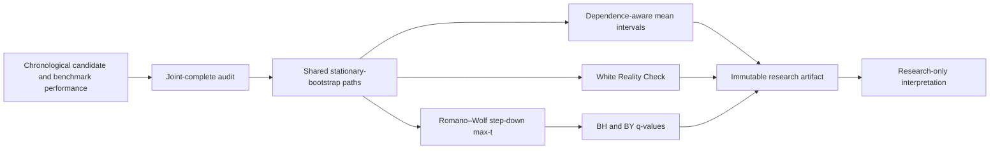

# Dependence-aware Evidence Lab

The Evidence Lab asks a narrow question after a family of factors, forecasts, or policies
has already been searched:

> Does the best observed candidate still show evidence after preserving serial dependence
> and accounting for the fact that many alternatives were tried?

It is an offline falsification tool. It does not generate signals, positions, orders, or
deployment recommendations. No empirical result is stored in this repository.

## Input contract

The Python API accepts a chronological `DataFrame` of performance differentials:

```text
d[t, j] = performance[t, candidate_j] - performance[t, frozen_benchmark]
```

Positive values therefore favor the candidate. The CLI accepts a CSV containing a date,
one frozen benchmark column, and one or more candidate columns, then constructs the
differentials explicitly.

All candidates are tested on the same joint-complete observations. Missing rows are dropped
and counted in the artifact rather than silently imputed. The time index must be sorted and
unique.

## Paper-to-tool pipeline



### 1. Stationary bootstrap

Independent row resampling destroys volatility clustering and serial correlation. Following
Politis and Romano (1994), each bootstrap path is made of circular blocks with geometrically
distributed lengths. If the expected block length is `L`, a new block begins with probability
`1/L` at every observation.

The implementation uses one shared set of bootstrap paths for the whole candidate family.
This preserves contemporaneous dependence between candidates, which matters for joint tests.

Public functions:

- `stationary_bootstrap_indices()`;
- `stationary_bootstrap_mean_intervals()`.

### 2. White Reality Check

Testing only the best candidate as if it had been specified in advance understates selection
risk. White (2000) tests the family-level null:

```math
H_0: \max_j E[d_{t,j}] \le 0.
```

The observed statistic is the maximum candidate mean scaled by the square root of the sample
size. The stationary bootstrap estimates its null distribution after recentering every
candidate differential at its own sample mean.

Public function: `white_reality_check()`.

Rejecting this global null says that the searched family contains evidence against the frozen
benchmark. It does not identify an executable strategy and does not prove that the current
winner will survive fresh forward data.

### 3. Romano–Wolf step-down max-t

A global rejection does not establish which candidates remain credible. Romano and Wolf
(2005) use a studentized, stepwise maximum statistic to control the family-wise error rate
while retaining the joint dependence structure. The public implementation orders candidates
by their observed studentized means and applies the shared bootstrap distribution to the
remaining family at every step.

Public function: `romano_wolf_stepdown()`.

The result includes:

- unadjusted stationary-bootstrap p-values;
- Romano–Wolf family-wise adjusted p-values;
- Benjamini–Hochberg q-values;
- Benjamini–Yekutieli dependence-robust q-values.

BH is useful when its independence or positive-dependence conditions are defensible. BY adds
the harmonic correction for arbitrary dependency and is deliberately more conservative.
Romano–Wolf remains the primary joint inference because it resamples the actual candidate
dependence rather than replacing it with a generic bound.

## Python API

```python
import pandas as pd

from xalpha_lite import BootstrapDesign, evidence_report

candidate_performance = pd.read_csv("candidate_performance.csv", index_col="date")
differentials = candidate_performance.drop(columns="benchmark").sub(
    candidate_performance["benchmark"], axis=0
)

report = evidence_report(
    differentials,
    BootstrapDesign(
        repetitions=2_000,
        expected_block_length=10,
        confidence=0.95,
        alpha=0.05,
        random_seed=20260809,
    ),
)
```

## Command line

```bash
xalpha-evidence \
  --performance candidate_performance.csv \
  --benchmark benchmark \
  --date-column date \
  --repetitions 2000 \
  --expected-block-length 10 \
  --output outputs/evidence.json
```

The JSON artifact contains method configuration, missing-data audit, confidence intervals,
joint and candidate-level tests, literature identifiers, input/configuration hashes, runtime
versions, and the invariant empty execution fields:

```json
{
  "status": "diagnostic_only_research_only_not_trading",
  "orders": [],
  "automatic_trading_changes": []
}
```

## Preregistration requirements

Freeze these choices before inspecting the test output:

1. benchmark and performance measure;
2. candidate family and complete historical trial ledger;
3. sample boundaries;
4. expected block length;
5. bootstrap repetitions;
6. family-wise/FDR threshold;
7. missing-data policy.

Changing one after seeing the result creates another experiment and must increment the trial
ledger. The block length is not innocuous: too short can lose dependence, while too long can
produce unstable finite-sample inference.

## Primary references

- Politis, D. N., & Romano, J. P. (1994). *The Stationary Bootstrap*. Journal
  of the American Statistical Association, 89(428), 1303–1313.
  [DOI](https://doi.org/10.1080/01621459.1994.10476870)
- White, H. (2000). *A Reality Check for Data Snooping*. Econometrica, 68(5),
  1097–1126. [DOI](https://doi.org/10.1111/1468-0262.00152)
- Romano, J. P., & Wolf, M. (2005). *Stepwise Multiple Testing as Formalized
  Data Snooping*. Econometrica, 73(4), 1237–1282.
  [DOI](https://doi.org/10.1111/j.1468-0262.2005.00615.x)
- Benjamini, Y., & Hochberg, Y. (1995). *Controlling the False Discovery Rate:
  A Practical and Powerful Approach to Multiple Testing*. Journal of the Royal
  Statistical Society: Series B, 57(1), 289–300.
  [DOI](https://doi.org/10.1111/j.2517-6161.1995.tb02031.x)
- Benjamini, Y., & Yekutieli, D. (2001). *The Control of the False Discovery
  Rate in Multiple Testing under Dependency*. Annals of Statistics, 29(4),
  1165–1188. [DOI](https://doi.org/10.1214/aos/1013699998)

## Non-claims and limits

- The stationary bootstrap requires a defensible weak-stationarity approximation.
- A bootstrap p-value is not a posterior probability that a factor is true.
- Reality Check can be conservative when the family contains many poor candidates.
- Step-down and FDR procedures do not repair lookahead, survivorship, stale fundamentals,
  invalid execution assumptions, or an incomplete candidate ledger.
- Historical evidence never authorizes automatic deployment.
