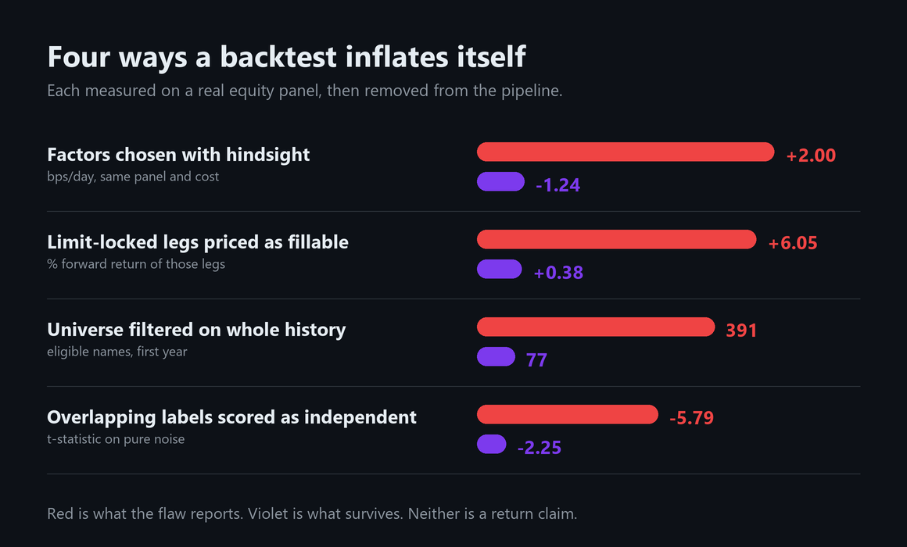

<h1>
  
  Perception-XAlpha Lite
</h1>

[](https://pypi.org/project/perception-xalpha-lite/)
[](https://github.com/xuxingjiankr-cpu/perception-xalpha-lite/actions/workflows/ci.yml)
[](https://www.python.org/)
[](#研究完整性约定)
[](../LICENSE)

[English](../README.md) | **简体中文**

[检验你的回测](#检验你自己的回测) &middot; [实时记录](#预测在它对应的那个交易日之前公布) &middot; [实测偏差](#为什么门槛设得这么严) &middot; [目前活下来的](#目前活下来的) &middot; [快速开始](#快速开始) &middot; [Wiki](https://github.com/xuxingjiankr-cpu/perception-xalpha-lite/wiki)


> **量化挖因子表面上是个优化问题,实际上是个多重比较问题。** 这个框架**故意**找到更少的因子。

一个会先试图推翻自己结论的研究框架:生成公式化因子,在 point-in-time 数据上按真实成本回测,
然后在相信它之前,想尽办法证明它是假的。

它把**提出假设**和**接受证据**分开。它可以合成因子,但每个候选都必须活过时间隔离、
反事实对照、置换检验和多重检验校正。历史证据只能产出一个"待前瞻验证的假设",
永远产不出一个订单。它**刻意不是**一个交易引擎。

## 研究记录

- **[Wiki](https://github.com/xuxingjiankr-cpu/perception-xalpha-lite/wiki)** — 每个设计决定背后的实测数据,包括被否掉的假设
- **[研究看板](https://github.com/users/xuxingjiankr-cpu/projects/1)** — 在测什么、否掉了什么、什么在等前瞻数据
- **[站点](https://xuxingjiankr-cpu.github.io/perception-xalpha-lite/)** — 同样的内容,渲染版

## 检验你自己的回测

```bash
pip install perception-xalpha-lite
```

Fork 这个仓库,把你自己的日收益放进 `audit/returns.csv`,在 `audit/audit.json` 里
写清你**实际试过**多少个变体,推上去。检验在**你自己的 fork 里**运行,结论写进 Actions 摘要。
你的收益数据不离开你的仓库 —— 这边永远看不到。

```bash
python tools/audit_returns.py
```

它问三个**并不是同一个**的问题:

| | |
|---|---|
| **赢家是不是靠运气挑出来的?** | CSCV 把样本切成很多种组合,每次取样本内最优的那个变体,看它落到样本外的什么位置。超过 0.5,说明干活的是"挑选"这个动作本身。 |
| **这个 Sharpe 大到能扛住产生它的那次搜索吗?** | Deflated Sharpe 用"同样试验次数下纯噪声能给出的最好 Sharpe"去折算你观察到的值。 |
| **把整个变体族一起算进去,还有谁跑赢零吗?** | White's Reality Check,用保留序列相关性的 stationary bootstrap。 |

自带的例子是 **24 组纯随机数**。其中最好的一组年化 Sharpe **1.11** —— 这个数字大多数人会拿去实盘。
而 24 次试验下,纯噪声的期望最高值是 **1.18**。结论:`SELECTION IS DOING THE WORK`。

试验次数指你**试过**的变体数量,**包括你删掉的每一个**,不是文件里的列数。
少报它是一个回测通过本该通不过的检验的头号方式 —— 当这两个数字相等时,工具会直接警告你。

## 预测在它对应的那个交易日之前公布

[](https://xuxingjiankr-cpu.github.io/perception-xalpha-lite/#live)

每天收盘后,一个冻结的规则(`dea0e608`)从约 4700 只合格股票里选出一只,带时间戳提交到这里,
**在那个市场开盘之前**。文件是 append-only 的。整条链路——取数、选股、打分、重绘——都在
GitHub runner 上用公开数据跑,所以任何人都能自己重跑一遍,得到同一只票。

同时在跑的是两条不同的记录,回答不同的问题:

| 记录 | 持仓 | 持有 | 在哪跑 |
|---|---|---|---|
| `dea0e608` — 上图 | 1 只 | 1 个交易日 | GitHub Actions,事前公布 |
| `b19bbc74` / `c0768449` | 10 只 | 10 个交易日 | 作者本机,来自 456 候选搜索 |

这个先后顺序就是全部主张。事后打分的记录永远会被问"结果出来之后你有没有偷偷改规则";
事前公开的不会 —— 它可以被证明是错的,但不能被修改。

**左边那段虚线灰底的部分什么都证明不了**,而且是故意画成那样的。那几个因子是从 456 个候选里
挑出来的,而挑选用的数据和这段窗口重叠;在这个面板上,**光是"挑选"这一步就值约 3 bps/天**。
一条样本内跑赢所有指数的曲线,正是一个被挑选出来的策略必然的样子。只有实线那段才是证据,
图上写着它有多少个交易日 —— 而几个交易日什么都说明不了:成绩单在不足60个到期条目时
一律报 `insufficient_forward_sample`,而且还会这样报好几个月。

两个经常被混为一谈的数字,在回测段上:

| | 累计 |
|---|--:|
| 策略,**原始收益**扣成本 —— 这个才能和指数比 | ≈ +60% |
| 可选股票池,等权 | +24.7% |
| 沪深300 | +20.3% |
| 上证50(富时A50的境内替代) | +8.6% |
| 策略,**相对股票池的超额** —— 这才是研究指标 | +18.5% |

拿超额去比原始指数是这个行当里最老的把戏,所以图上把它们画成两条线,并写明各自回答什么问题。
GitHub Action 每天独立重拉指数,任何一个已提交的基准收益漂移超过 5bp 就拒绝重绘。

## 为什么门槛设得这么严

四个偏差,每一个都是在搭这条管线的过程中,在真实股票面板上**实测**出来的,
每一个单独拿出来都足以凭空造出一个"策略":



| 缺陷 | 它报告的 | 修正后剩下的 | 单位 |
|---|--:|--:|---|
| 用后见之明挑因子 | **+2.00** | −1.24 | bps/天,同面板同成本 |
| 把涨跌停封死的腿当成能成交 | **+6.05** | +0.38 | 这些腿的前瞻收益 % |
| 用全历史过滤股票池 | **391** | 77 | 第一年的合格股票数 |
| 把重叠标签当独立样本 | **−5.79** | −2.25 | 纯噪声上的 t 值 |

第一行值得停下来想一想。同样的数据、同样的成本模型、同样的组合构造,
**只有挑因子的规则不同**,差距约 3 bps/天。这比大多数已发表的股票因子结果还大 ——
意味着一条**无法审计自己挑选步骤**的管线,根本分不清"发现"和"挑选的副产品"。

这个机制在完全没有信号的合成数据上十秒就能复现:

```bash
python examples/selection_artifact.py          # 从纯噪声里造出 IR 4.53
python examples/make_corrections_figure.py     # 重新生成上面那张图
```

## 目前活下来的

四个已发表因子库(Kakushadze 101、GTJA 191、Qlib 158、学术)的全部因子,在 point-in-time A股面板上,
**只用训练窗口**按十只股票组合的均值超额排序,再到完全没碰过的测试窗口上报告。900个交易日,
2024-12-31 切分,每日调仓,持有十个交易日,信号次日开盘进、十日后开盘出,涨跌停封死的腿直接剔除。
超额是相对等权可选股票池,该股票池在测试窗口上是 **+0.85%** 每持有期。

| # | 因子 | 训练期超额 | 测试期超额 | >10%概率 | 单期最差 | 胜率 |
|---|---|--:|--:|--:|--:|--:|
| 1 | `academic/hml` | +2.20% | −0.04% | 1.01× | −17.5% | 49.2% |
| 2 | `qlib158/imin60` | +0.81% | −0.73% | 0.53× | −11.6% | 36.7% |
| 3 | `gtja191/alpha_144` | +0.73% | **+0.17%** | 1.16× | −7.5% | 46.5% |
| 4 | `academic/cma` | +0.67% | **+0.26%** | 0.72× | −9.4% | 48.9% |
| 5 | `qlib158/vsumn20` | +0.66% | **+0.40%** | 0.86× | −6.4% | 50.5% |

**不计成本,而且明说。** 重叠序列上按换手计费,三种都站得住脚的约定给三个不同答案;
一个任何人都能复算的毛数字,比一个没人能复算的净数字有用。按 30bp 双边算,
每个持有期完全换手的组合要从上面的数字里还回去 0.30%。全部456个的完整排名在
[`docs/data/library_ranking.json`](data/library_ranking.json)。

### 同时过了两道门的

上面那张表**只用训练数据**排序,这是诚实的实验设计。合理的追问是:那些名字后来怎么样了。
训练窗口上排名**前三十**的因子里,有**两个**同时通过了两项样本外检验 —— 超额为正,
**并且**大涨概率高于基准:

| 训练排名 | 因子 | 它测量什么 | 测试期超额 | >10%概率 | 单期最差 | 胜率 |
|--:|---|---|--:|--:|--:|--:|
| 3 | `gtja191/alpha_144` | 20日内单位成交额的平均\|收益\|,**只在下跌日上计算** —— 下行价格冲击 | **+0.17%** | **1.16×** | −7.5% | 46.5% |
| 30 | `academic/illiq` | Amihud (2002):21日内单位成交额的平均\|收益\| —— 价格冲击,全部交易日 | **+0.14%** | **1.18×** | −7.8% | 47.9% |

**三十里出两个,这就是产出率。** 之所以写成"2/30"而不是凑成前五名,是因为**没有第三个**。
要凑够五行,就得拿全部456个按**测试窗口的结果**重排 —— 那正是这个项目
[量化过的后见之明偏差(+2.00% vs −1.24%)](#为什么门槛设得这么严)。
那样拼出来的表,不包含任何你当时能据以行动的信息。

**这两个存活者是同一个东西。** 两者都是"单位成交额的平均绝对收益":Amihud 非流动性,
以及同一个量只在下跌日上算。这个一致性有价值 —— 存活的不是两个不相干的偶然,
而是**一个经济机制(流动性溢价)出现了两次**。但这同时意味着它们**不是两份独立证据**,
一本把它们当作两次的试验台账,会以上面那对重复因子完全相同的方式高估自己的广度。

全部456个里有 79 个(17.3%)同时满足这两个条件,而若两者独立且与能力无关,预期约为 10.7%。
这是真实的富集 —— 而按测试结果去挑那 79 个仍然是后见之明,所以这里只给数量,不给名字。

### 换成组合口径,而不是超额口径

相对可选股票池的超额是研究指标,因为它把市场剥离掉了。但它不是持有人真实体验到的东西,
而且**那个股票池根本买不到** —— 等权持有四千只A股不是一个组合。所以用原始口径,在测试窗口上:

| | 每十日持有期 | 上涨概率 |
|---|--:|--:|
| 训练期前十名,等权 | **+0.61%** | **61.4%** |
| 可选股票池,等权 | +0.85% | 62.2% |

**组合是赚钱的,五次里涨三次。** 它同时在这两项上都落后于它所来自的股票池 —— 而这就是全部发现:
**收益是真的,能力没有被证明。** 只报第一行,和拿超额去比原始指数是同一个动作,只是方向相反。

### 钉死数据源到底值多少

一次供应商故障打断了 2026-08-12 和 2026-08-13 的 17:00 运行。加个备用源是显而易见的修法,
而**不验证就上线,就是让上一版 spec 退役的那个错误再犯一次**。所以同一条冻结规则,在两个不同供应商的后复权A股面板上
各跑一遍 —— baostock(spec 指名的)和 TDX(候选备用源)—— 只比一件事:**各自选出哪只票。**

| | |
|---|--:|
| 比较的交易日 | 140 |
| **两边选出同一只票的比例** | **57.9%** |
| 分歧时,另一个源选的票在主源排名 | **中位第 4** / 约4700 |

**备用源没有采纳。一个会在 42% 的交易日改变答案的源,不是备用源,是另一条规则。**
[数据已公开](docs/data/source_reconciliation.json)。

**最终两天都没有变成空洞**:21:00(北京)的第二次尝试两次都成功,各自在对应交易日开盘前
发布了预测。这正是补跑的用途,而且它比换数据源是更好的答案 —— **晚一点再跑,是拿同一条规则
问同一个源;换个源,是换了条规则然后指望没人核对。**

**分歧是"并列",不是"发散"。** 中位排名第 4 意味着两个源通常是在合成分数分不开的候选里
换赢家。而领先明显时它们从不分歧:最近 8 个交易日两边选出同一只票,该票以 0.945 领先
次名的 0.872。

由此得出两条,第二条比第一条重要。

**在 spec 里指名数据供应商是必要的,不是迂腐。** 照 spec 复算的人用同一个源,拿到同样的名字,
记录精确复现 —— 这正是 `dea0e608` 冻结时要保证、而上一版没做到的事。如果数据源留白,
**42% 的已发布选股将无法被一个同样严谨的读者复现。**

**单票组合是这条规则能产出的最脆弱的东西。** 接近一半的交易日,赢家在小数点后第四位被决定,
而两个诚实的供应商对同一批复权价的差异就足以翻转它。这是"只持有一只"的性质,不是数据的性质:
分歧的中位排名是 4,一个十只组合几乎总会包含对方选的那只。**两条记录里,十只那条更有意义**,
而本页那张单票曲线,应该带着"是什么在决定它"的认识去读。

### 挑选是有效的,而且不够

真正重要的数字不在表里。456 个因子上,训练期超额对测试期超额的
**Spearman ρ = +0.48**(p < 0.001)—— 训练期排序确实带信息,说"这全是噪声"的人是错的。

然后看这些信息买到了什么:

| | 测试期均值超额 | 跑赢股票池的比例 |
|---|--:|--:|
| 全部 456 个因子 | −0.71% | 21.3% |
| 训练期前 10 名 | **−0.24%** | 30.0% |

干净地在训练窗口上挑选,相比随机挑,每个持有期值 **+0.47 个百分点**。
但它**仍然是负的**。456 个里挑出的最好十个,在没看过测试窗口一眼的前提下,
样本外依然跑输了它们所来自的股票池。

这才是结果真实的形状,而且它不是通常讲的那两个故事中的任何一个。**信号是真的。
它比衰减和集中度拿走的更小 —— 这还没算一分钱成本。**

表里还有两件比排名本身更值钱的事:

- **第 1 行就是整个问题。** `hml` 在训练窗口上以 +2.20% 遥遥领先,样本外 −0.04%。
  第 5 名的训练期超额只有它的三分之一,却是五个里测试期最好的。训练排序和测试排序在
  456 个整体上相关,**在顶部几乎不相关 —— 而顶部正是所有人挑选的地方。**
- **因子库里有重复,重复计数会虚增试验次数。** `gtja191/alpha_120` 和 `alpha101/alpha_042`
  是逐字符相同的公式,发表在不同库里用不同名字。这次运行把它们**复现到了小数位**:
  训练 +0.358%、测试 −0.338%、单期最差 −9.5%,两个完全一样。deflated Sharpe 的分母
  该数**行为**,不是数文件。

### 这张表替换掉的那一张,复现不出来

上一版这一节报的是另外五个因子、另外一组数字,而盘上没有任何东西能重新生成它。
照着描述重建,**股票池基准精确对上了**(+0.820% vs 已发布的 +0.82%,这钉住了面板、窗口和切分点),
但在三种调仓与成本约定下,**没有一个单独因子能对上** —— 其中一个连符号都相反。

继续换约定直到数字吻合,就是**为了得到答案去拟合方法**,而那正是这个仓库存在要指认的失败。
所以这张表被换成了一个提交在案的脚本能重新生成的版本。

前瞻记录里冻结的那四个因子,正是由那个无法复现的排名选出的。在这个排名下它们是
**456 个里的第 4、30、57、234 名** —— `academic/cma`、`academic/illiq`、`qlib158/rsqr60`、
`qlib158/rsqr30`,最后一个在中位数以下。这**不削弱**
[前瞻记录](#预测在它对应的那个交易日之前公布):一条在数据产生之前就冻结的规则,
由接下来发生的事检验,而不是由它当初怎么被挑出来检验。但它确实意味着
"为什么是这四个"这个说法**无法核实**,而且这是第三次独立证明:这个排名在不同的合理选择下不稳定。

## 它跑的就是它描述的那套东西

这不是一个摆在研究旁边的方法库。它所服务的 A股项目的冻结前瞻记录,就跑在这个包上 ——
`build_panel`、`point_in_time_eligibility`、`long_only_book`、`score_log`——单票轮动跑在
GitHub runner 上,十票记录跑在作者本机,两条都每天追加。

把它对准真实工作,才发现了那些缺口。一次就四个:

| 用它才发现的 | 是什么 |
|---|---|
| `build_panel` 把 `limit_up`/`limit_down` 默认填 `False` | 纯 OHLCV 面板会**在封死的板上回测成交**,这种腿 +6.05% 而可成交的腿只有 +0.38% |
| 没有 point-in-time 股票池规则 | 只能手搓,而幸存者偏差正是从这里进来的 |
| 只有美元中性组合 | 几乎所有人实际在交易的构造 —— 纯多头 top-N —— 表达不出来 |
| DSL 里没有时间趋势 | 整个已发表的因子族(`ts_corr(close, t, w)²`)无法表达 |

四个现在都进库了。迁移是**验证过**而不是假设的:每个因子用两种方式在 400 个交易日 × 5169 只股票上
重算,截面 rank 差最大 **0.00e+00**;移植后的规则产出的第一个组合,和原管线的十只里有九只相同。

前瞻记录的价值完全在于它**拒绝**做什么 —— `freeze_spec` 不覆盖、`load_spec` 拒绝加载冻结后被改过的文件、
已记录的交易日再写入无效、`score_log` 只统计完全走完的持有窗口。CI 断言这四条仍然会触发,
因为一个守卫失效的前瞻记录,就只是个回测。

```bash
python examples/run_forward_record_synthetic.py
```

这个例子在**完全没有漂移的价格**上跑出 **+0.32% 净收益**,并在 n=6 时判定为
`insufficient_forward_sample`。这正是重点:那个数字是噪声,而框架会直接说出来,
而不是把它当成结果打印。

## 快速开始

```bash
pip install perception-xalpha-lite      # 或从源码: pip install -e .

python examples/run_synthetic.py                    # 完整发现流程,合成数据
python examples/selection_artifact.py               # 从纯噪声造出 IR 4.53
python examples/run_forward_record_synthetic.py     # 冻结规则的前瞻记录契约
python tools/audit_returns.py                       # 检验一组收益是否过拟合
```

## 数据契约

**行情**:必须提供 `date, symbol, open, high, low, close, volume, amount`。
`limit_up`/`limit_down` 如果数据源没给,用 `apply_sealed_bar_limits` 从K线自身推断 ——
一根 `high == low` 的K线就是封板,方向看前收,不假设任何百分比阈值,所以 10%/20%/30% 三种板都能处理。

**财务**:`notice_date` 是**强制**的。一个值最早出现在 `max(notice_date, update_date)` **之后**的
第一个交易日,绝不用报告期末日期对齐。缺 `notice_date` 的行直接拒绝,不做猜测。

## 研究完整性约定

- 研究代码里**不存在**任何下单路径,CI 每次提交都会机械地断言这一点。
- 所有输出的 `orders` 字段恒为空。
- 历史证据只能产出"待前瞻验证的假设",永远产不出结论。
- 一个冻结的规则不会被修改,只会被新规则取代,而旧规则连同它已发布的记录一起留着。

## 局限

- 示例是合成数据,不构成任何盈利主张。
- 公开财务接口不一定保留每一次历史重述的版本。
- 用当期的证券主表会带来幸存者偏差,除非换成真正的 point-in-time 成分股历史。
- 零投资研究组合在只能做多的现金市场里不能直接执行。
- 等权重叠 tranche 是对持有期的近似,不建模排队优先级、融券可得性、市场冲击或场所容量。
- HMM、EWS、BOCPD、DMD、LPPLS、Black–Litterman、Triple Barrier 都是最小可审计原语,
  不是生产级求解器,也不构成任何预测能力的主张。
- Stationary bootstrap 推断依赖一个站得住脚的弱平稳近似;
  **没有任何重采样方法能修复被污染的数据或一本不完整的试验台账。**

## 许可

MIT。仅供研究使用。这里没有任何内容构成投资建议。
